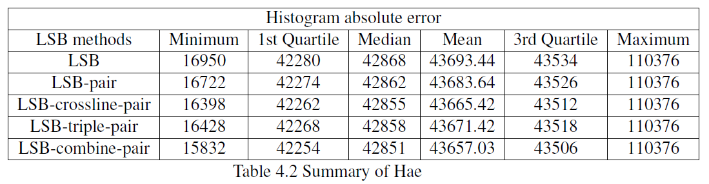
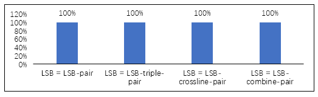

# README

        

This code is the application of **improved LSB pair replacement** approaches to *reduce distortion* of watermarking image.

This code is developed in MATLAB.

 

### Getting everything ready

Before running the code, you need get following things ready:

* MATLAB (this code in tested by R2018a)
* *Grayscale* images need to be stored in `grayscale photo` folder.
* A `watermark.txt` txt file contains the watermarking message, it need located in `root` folder.
* Following empty folders to store output watermarked images. 

 

### How to run it

[`LSB_RUN`](https://github.com/boooooommmmmm/Digital_Watermarking-LSB-pair/blob/master/code/LSB_run.m)is the only file which is executable in MATLAB. While running it, it will automatically reading all image files in the `grayscale photo` folder. 

The code will using following watermarking methods:

> Regular LSB replacement
>
> LSB pair
>
> LSB dual pair
>
> LSB triple pair
>
> LSB ultra pair

After finishing watermarking, the following measurement methods will be used to evaluate the performance of each approaches:

>PSNR
>
>SSIM
>
>Hae (histogram absolute error)

 

##### Outputs

* Watermarked images for each methods
* Extract message for each methods
* Three Excel documents for three measurement results

 

### Knowledge based

### Result & Evaluation

For this algorithm, we used three image quality measurement functions to test it. `PSNR`, `SSIM` and `Hae`. The detailed results are listing:

PSNR

SSIM

Hae

 

**PSNR**

**SSIM**

**Hae**

 

 

#### Compare

### Future work

------

END